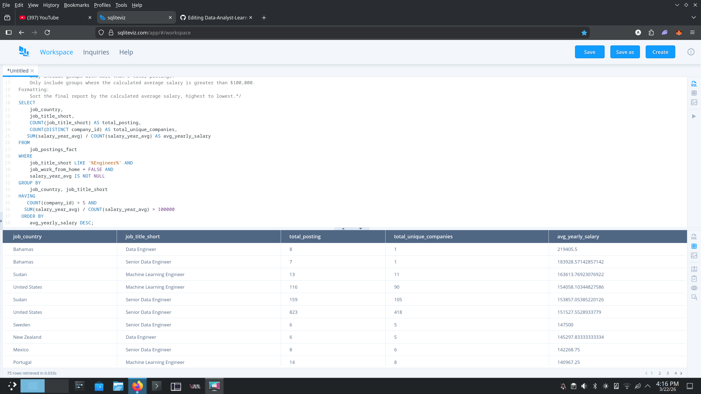

# 📊 Data-Analyst-Learning-Journey

> A BSOA student documenting the path to becoming a Data Analyst — one query at a time.

---

## 👤 About Me
- 🎓 BSOA Student with a focus on Data Analytics
- 📚 Currently learning SQL through Luke Barousse's course
- 🛠️ Tools: SQLiteViz | Dataset: Job Postings Data
- 🎯 Goal: Land a Data Analyst role

---

## 📁 Repository Structure

| File | Description |
|------|-------------|
| `*.sql` | Raw SQL queries with task brief in comments |
| `*.md` | Full breakdown — logic, lessons, and reflection |
| `screenshots/` | Query result screenshots |

---

## 📌 Challenges Log

| Day | Challenge | Topics Covered |
|-----|-----------|----------------|
| Day 1 | On-Site Engineering Markets Report | GROUP BY, HAVING, LIKE, COUNT DISTINCT, Manual AVG |
| Day 2 | High-Paying Remote Partner Analysis ("Gold Standard") | LEFT JOIN, Table Aliasing, Clause Order of Execution, AVG() |

---

## 📸 Project Showcase

### Day 1: Engineering Markets
*Filtering and grouping on-site roles to find market trends.*

### Day 2: The "Remote Elite" Employers
*Connecting Fact and Dimension tables to identify the highest-paying companies for remote Data Analysts.*

---

## 🧠 SQL Concepts Covered So Far
- SELECT, FROM, WHERE
- AND / OR filtering
- LIKE pattern matching
- ORDER BY ASC / DESC
- GROUP BY
- HAVING
- COUNT, COUNT DISTINCT
- Manual AVG calculation (SUM / COUNT)
- Modulo operator (% 2 = 1)
- **LEFT JOIN (Connecting Fact and Dimension tables)**
- **Table Aliasing (e.g., `job_postings_fact AS jobs`)**
- **Aggregate Functions (AVG, COUNT with Joins)**
