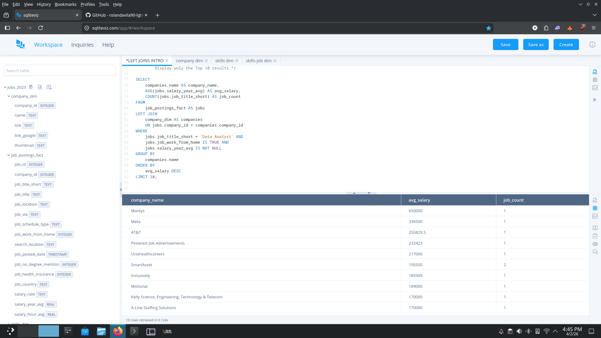

# 📊 Data-Analyst-Learning-Journey

> A BSOA student (3rd year) learning SQL week-by-week. Documenting the path to becoming a Data Analyst — one query at a time.

---

## 👤 About Me
- 🎓 **BSOA Student (3rd year)** with a focus on Data Analytics
- 📚 Currently learning SQL through **Luke Barousse's course**
- 🛠️ **Tools:** SQLiteViz | **Dataset:** Job Postings Data
- 🎯 **Goal:** Land a Data Analyst role

---

## 📅 Learning Progress

| Week | Focus | # Queries | Status | Key Concepts |
|------|-------|-----------|--------|--------------|
| Week 1 | Grouping & Aggregates | 1 | ✅ Complete | GROUP BY, HAVING, COUNT DISTINCT |
| Week 2 | JOINs & Multi-Table | 1 | ✅ Complete | LEFT JOIN, Table Aliasing |

---

## 🚀 Project Showcase

### Week 1: On-Site Engineering Markets
*Goal: Identify high-volume and high-paying markets for on-site engineering roles.*

**💡 Data Story & Insights:**
- **Volume vs. Niche:** The United States dominates in sheer volume, offering hundreds of on-site roles averaging over $150,000.
- **The Outliers:** The highest average salary appeared in the Bahamas ($219k+), but this was driven by a single company posting only 8 roles. This indicates that while niche international markets offer extreme compensation, the US remains the most stable market for these roles.

---

### Week 2: The "Remote Elite" Employers
*Goal: Connecting Fact and Dimension tables to identify the highest-paying companies for remote Data Analysts.*

**💡 Data Story & Insights:**
- **Market Competitiveness:** While traditional tech giants (**FAANG**) like Meta are present, the data shows that healthcare (**Uclahealthcareers**) and telecommunications (**AT&T**) offer highly competitive salaries above $160k for remote talent.
- **Exclusivity:** Most top-paying roles have a job count of 1, suggesting these are highly specialized **"unicorn"** positions rather than mass-hiring phases.
- **Salary Benchmark:** For a remote Data Analyst, the current **"Gold Standard"** ceiling in this dataset sits at approximately **$172,500**.

---

## 🧠 SQL Concepts Covered So Far
- **Filtering:** SELECT, FROM, WHERE, LIKE, AND/OR, IS NOT NULL
- **Aggregations:** GROUP BY, HAVING, COUNT, AVG, SUM
- **Advanced:** LEFT JOIN, Table Aliasing, Modulo operator (% 2 = 1)
